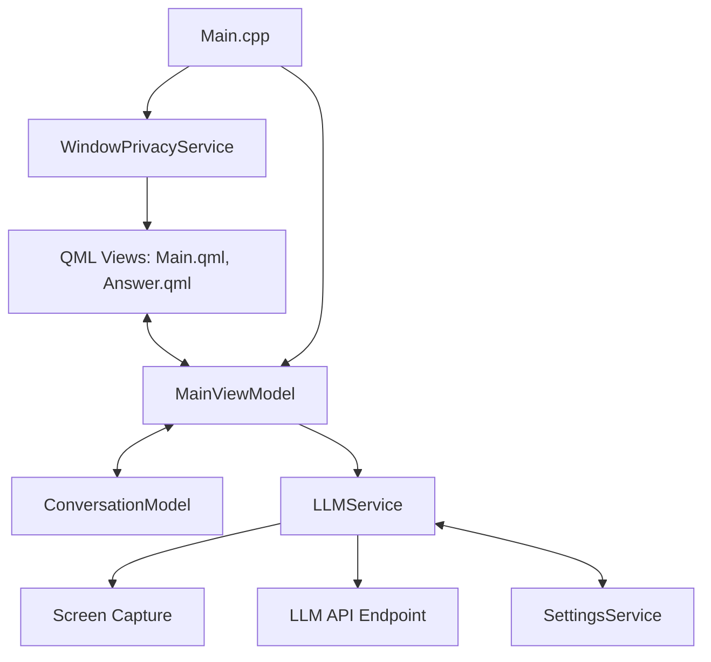
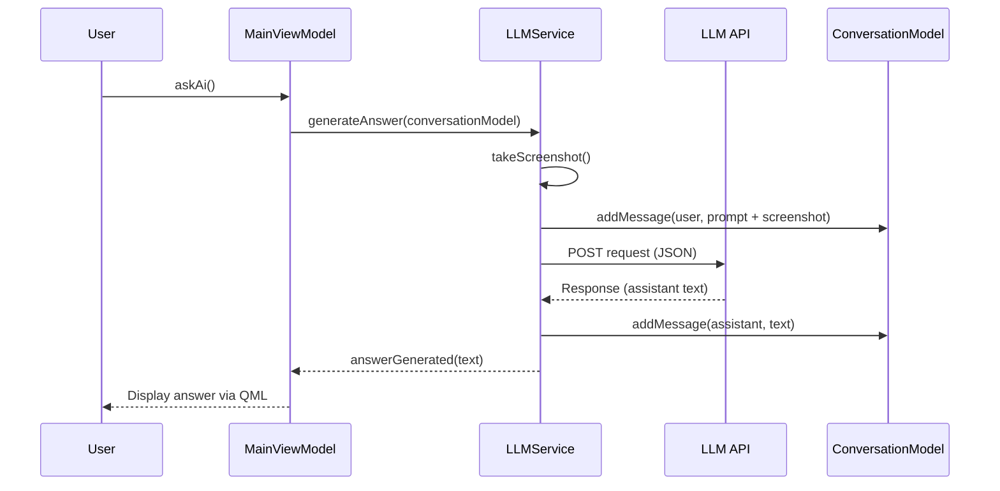

# Nudgly

Open Source Cluely Alternative: Gives You Just A Little Nudge.

Nudgly is a cross-platform (macOS and Windows) AI-powered assistant designed to provide real-time, actionable insights by analyzing your screen. It captures the current state of your display and uses Large Language Models (LLMs) to solve problems, answer questions, or provide "nudges" based on what you are currently working on.

## Core Features

- **Screen Analysis**: Captures high-resolution screenshots to provide context-aware assistance.
- **Multi-Domain Problem Solving**: Specialized handling for technical coding, mathematics, UI navigation, email drafting, and more.
- **Privacy-Centric**: Implements native window privacy features to exclude the application itself from screen captures and recordings.
- **MVVM Architecture**: Clean separation of concerns using Qt/QML for a responsive and maintainable codebase.
- **Enterprise-Ready**: Includes logic for live-meeting co-piloting and transcript analysis.

## Architecture

Nudgly is built using C++20 and the Qt 6 framework, following the Model-View-ViewModel (MVVM) design pattern.

### System Overview



### Component Breakdown

| Component | Responsibility |
| :--- | :--- |
| **MainViewModel** | Orchestrates application state, handles UI triggers, and communicates with services. |
| **ConversationModel** | Manages the history of messages (user and assistant) in a format suitable for both the UI and API. |
| **LLMService** | Handles screenshot capture, image processing (Base64 conversion), and API communication with LLM providers. |
| **WindowPrivacyService** | Native implementation (macOS/Windows) to prevent the application window from being captured by itself or other software. |
| **SettingsService** | Manages persistent application configuration such as API keys and model preferences. |

## Interaction Flow

The following diagram illustrates the sequence of events when a user requests assistance:



## Prompting and Personality

Nudgly follows a strict set of operational guidelines to ensure high-quality, professional responses:

- **Specific and Actionable**: Responses focus on direct solutions rather than conversational filler.
- **Formatting**: Uses Markdown for structured text and LaTeX for mathematical formulas.
- **Identity**: Identifies as "Nudgly" and avoids referencing specific LLM providers.
- **Context-Aware**: Adapts behavior based on visible content (e.g., automatically entering coding mode if a code editor is detected).

## Privacy and Security

Nudgly prioritizes user privacy. The `WindowPrivacyService` uses platform-specific APIs:
- **macOS**: Sets `sharingType` to `NSWindowSharingNone`.
- **Windows**: Uses `SetWindowDisplayAffinity` with `WDA_EXCLUDEFROMCAPTURE`.

This ensures that sensitive information displayed within Nudgly's own interface is never included in the screenshots sent to the LLM API.

## Technical Stack

- **Framework**: Qt 6.9+ (Core, Gui, Quick, Qml)
- **Language**: C++20, Objective-C++ (macOS), QML
- **Build System**: CMake 4.0+
- **API**: OpenAI-compatible chat completion endpoint

## Getting Started

### Prerequisites

- Qt 6.9.2 or higher
- CMake 4.0 or higher
- C++20 compliant compiler

### Build Instructions

1. Clone the repository.
2. Configure the project using CMake:
   ```bash
   cmake -B build -S . -DCMAKE_PREFIX_PATH=/path/to/qt/cmake
   ```
3. Build the application:
   ```bash
   cmake --build build
   ```
4. Configure your API key in the application settings or via `SettingsService`.

## License

This project is licensed under the terms of the LICENSE file included in the repository.